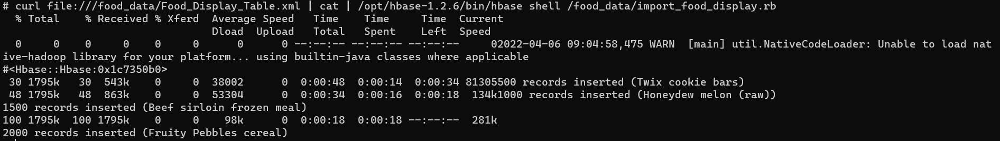

# Databases - Assignment 4 - HBase

Assignment 3: HBase Database for Food Nutrition Facts
see Seven Databases in Seven Weeks by Luc Perkins, 2nd Edition, p.82
The objective of this assignment is to provide you with experience in processing big data in a
column-oriented database and distributed mode.

The tasks are the following:

1. Download the MyPyramid Raw Food Data set from
   https://catalog.data.gov/dataset/mypyramid-food-raw-data and extract the zipped
   contents to find the Food_Display_Table.

This data consists of many pairs of Food_Display_Row tags. 

Inside these, each row has
a Food_Code (integer value), Display_Name (string), and other facts about the food
in appropriately named tags

2. Create a new HBase table called foods with a single column family to store the facts.

Argument your choice of a row key.

Due to the fact that many entries in the data script has the same name with only different measuring types, 
we have decided to use the display name as the row key, to group those different measurings together with the display name.

Suggest some alternative column family options that would make sense for this data.

The different information about the food, could be divided into families to make it easier to identify the different values about the food.

We would divide it as follows:

   - General - family for storing food_code and name.
   - Nutrients - family for nutrients in the food.
   - Portion - family for storing information about the portion size.

3. Create code for importing the food data into the new table, use programming language of
   your choice. Pipe the food data into your import script on the command line to populate
   the table.

Since we are running HBase in a docker container, we need to import the scripts into the container to begin with.

1. Connect to the docker container.

    
    docker exec -it hbase-master /bin/bash

2. Run command to create a folder for the files.

    mkdir food_data

3. Exit docker and run the following commands to import the files into the container.

    docker cp "Path_To_File"/Food_Display_Table.xml hbase-master:\food_data\Food_Display_Table.xml

    docker cp "Path_To_File"/import_food_script.rb hbase-master:\food_data\import_food_script.rb

As the picture below shows, the files was successfully imported into the 'foods' table.

4. With the two files put into the docker container, we can now import the script into our HBase 'foods' table. (From the docker container.)

    curl file:///food_data/Food_Display_Table.xml | cat | /opt/hbase-1.2.6/bin/hbase shell /food_data/food_import_script.rb<

4. Using either a client application or the HBase shell, query the foods table for providing
   information about your favorite foods.

We've decided to create the queries inside the HBase shell.

To do this, connect to the HBase shell:

    docker exec -it hbase-master /bin/bash
    hbase shell

Inside the HBase shell, we can run commands like the following:

A simple query by row key:

    get 'foods', "Sour cream dip"

A query by row key, with specification of family name:

    get 'foods', 'Whole wheat tortilla', {COLUMN => 'facts'}

But since we only have a single family with all the information, we get a similar result as the simple query.

This is a group project.

Your solution and a Peergrade review of three other solutions bring 20 credit point in total to your
accumulated score.

